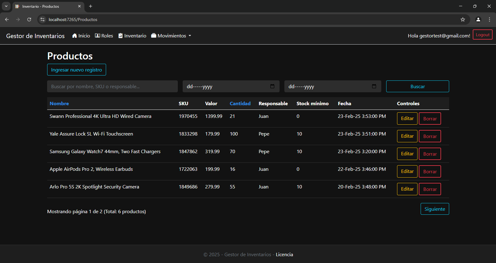
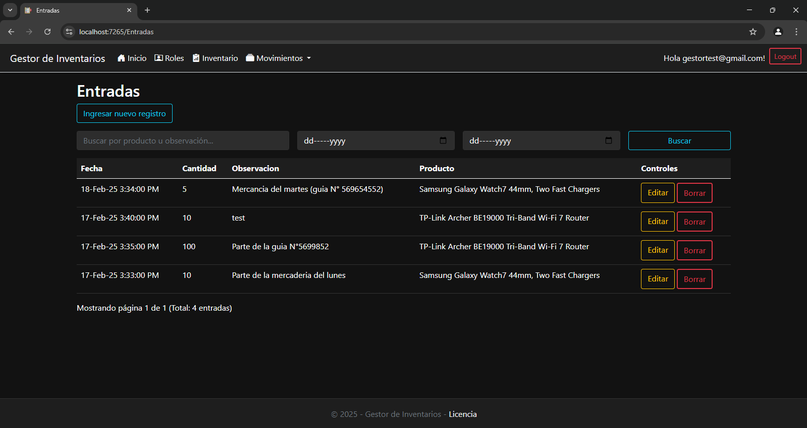
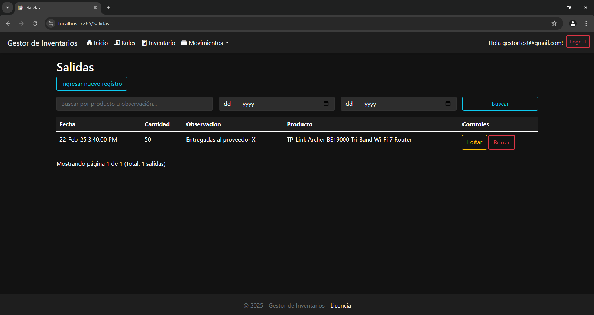
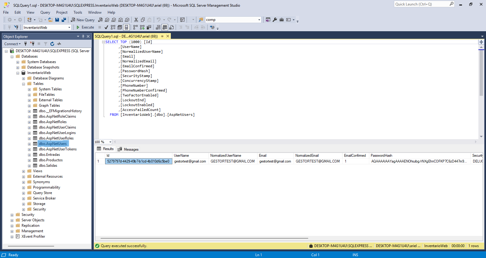
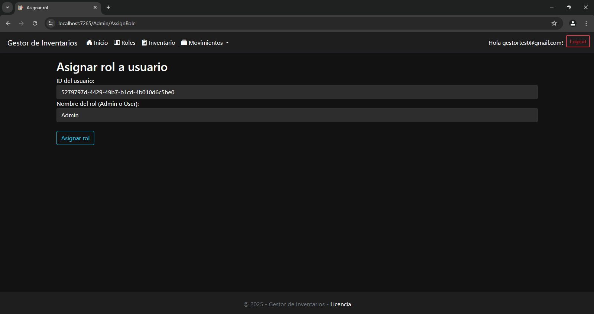

  

<h2 align="center">Gestor de inventarios básico</h2>

Este proyecto es un gestor de inventarios de escritorio que permite administrar el inventario de productos y registrar sus movimientos, específicamente las entradas y salidas. El sistema permite actualizar el stock de cada producto en tiempo real según las cantidades ingresadas o retiradas.

Cuenta con una interfaz de usuario fácil de usar, un sistema local de inicio de sesión y registro que, por defecto, encripta las contraseñas y permite asignar roles. Utiliza como base de datos SQL Server 2022.

<h2 align="center">Capturas</h2>

<h2 align="center">Configuración de usuarios y roles</h2>

El script de la base de datos incluye un usuario con el rol de **Admin**, que tiene permisos para acceder a la vista de **"Roles"** y asignar el rol de **Admin** a otros usuarios. Tanto las cuentas con rol de **Admin** como las de **User** pueden acceder al resto de las vistas (**Producto**, **Entrada** y **Salida**).

## Usuario con Rol de Admin por Defecto

- **Email:** `gestortest@gmail.com`  
- **Contraseña:** `Password123!`

## Asignación de Roles

Todas las cuentas nuevas creadas tienen el rol de **User** por defecto. Solo una cuenta con rol de **Admin** puede cambiar el rol de las cuentas registradas.

### Pasos para Cambiar el Rol de un Usuario

1. **Acceder a la Base de Datos:**
   - Dirígete al gestor de la base de datos y busca la tabla `AspNetUsers` para localizar a los usuarios registrados y obtener su `ID`.

   

2. **Copiar el ID del Usuario:**
   - Copia el `ID` del usuario al que deseas cambiar el rol.

3. **Cambiar el Rol en la Aplicación:**
   - Inicia sesión en la aplicación con una cuenta que tenga el rol de **Admin**.
   - Pega el `ID` copiado en el campo correspondiente.
   - En el campo de tipo de rol, ingresa el nombre del rol deseado (`Admin` o `User`).

   

<h2 align="center">Versión de escritorio de proyecto existente</h2>

Este proyecto es una versión web de una aplicación de escritorio originalmente desarrollada en **WPF** (Windows Presentation Foundation). Puedes encontrar el repositorio del proyecto original en el siguiente enlace:

- **Repositorio de la versión de escritorio:** [GestorDeInventarioWPF](https://github.com/lextrack/GestorDeInventarioWPF)

La versión web mantiene las funcionalidades principales del proyecto original, como la gestión de productos, entradas y salidas pero está adaptada para ser accesible desde un navegador web. Esto permite una mayor flexibilidad y acceso multiplataforma.

<h2 align="center">Requisitos de Ejecución</h2>

* Windows 10 o superior: La aplicación se desarrolló para sistemas Windows y se ha probado en Windows 10 y versiones posteriores.

* SQL Server 2022 Express: Debes tener instalado y configurado SQL Server para almacenar y administrar la base de datos. Se debe añadir la base de datos al gestor de base de datos. Hay un script de la base de datos en el código fuente del proyecto (la carpeta se llama BackupDB).

* .NET 8: Asegúrate de tener instalado .NET 8 para poder ejecutar la aplicación.

<h2 align="center">Paquetes usados</h2>

* Microsoft.EntityFrameworkCore.SqlServer
* Microsoft.EntityFrameworkCore.Tools
* Microsoft.AspNetCore.Diagnostics.EntityFrameworkCore
* Microsoft.AspNetCore.Identity.EntityFrameworkCore
* Microsoft.AspNetCore.Identity.UI
* Microsoft.VisualStudio.Web.CodeGeneration.Design

<h2 align="center">Licencia</h2>

Este proyecto está bajo la Licencia MIT. Consulte el archivo LICENSE para obtener más detalles.

<h2 align="center">Agradecimientos</h2>

Gracias a Falticon por los iconos usados en esta aplicación.

